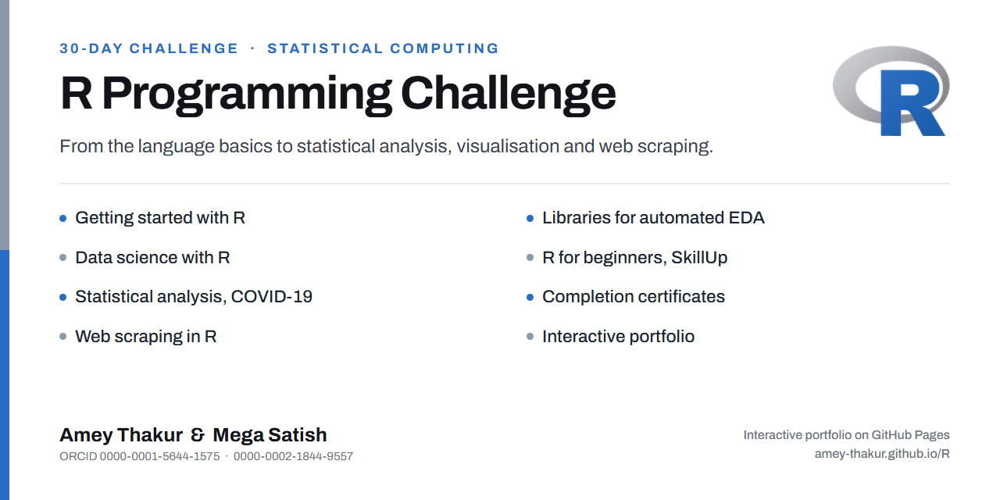

<div align="center">

  #  <br> R Programming Challenge

  [](LICENSE)
  
  [](https://github.com/Amey-Thakur/R)
  [](https://github.com/Amey-Thakur/R)

  **[View Interactive Portfolio](https://Amey-Thakur.github.io/R/)**

  A disciplined 30-day collaborative challenge undertaken to master R programming, statistical analysis, and data science, featuring a structured curriculum from basic syntax to advanced web scraping and certification.

  **[Curriculum](#features)** &nbsp;·&nbsp; **[Amey's Kaggle](https://www.kaggle.com/ameythakur20)** &nbsp;·&nbsp; **[Mega's Kaggle](https://www.kaggle.com/megasatish)** &nbsp;·&nbsp; **[Certifications](#results)**

  <br>

  

</div>

---

<div align="center">

  [Authors](#authors) &nbsp;·&nbsp; [Overview](#overview) &nbsp;·&nbsp; [Activity](#activity) &nbsp;·&nbsp; [Curriculum](#features) &nbsp;·&nbsp; [Structure](#project-structure) &nbsp;·&nbsp; [Certifications](#results) &nbsp;·&nbsp; [Quick Start](#quick-start) &nbsp;·&nbsp; [Usage Guidelines](#usage-guidelines) &nbsp;·&nbsp; [License](#license) &nbsp;·&nbsp; [About](#about-this-repository) &nbsp;·&nbsp; [Acknowledgments](#acknowledgments)

</div>

---

<!-- AUTHORS -->
<div align="center">

  <a name="authors"></a>
  ## Authors

| <a href="https://github.com/Amey-Thakur"></a><br>[**Amey Thakur**](https://github.com/Amey-Thakur)<br><br>[](https://orcid.org/0000-0001-5644-1575) | <a href="https://github.com/msatmod"></a><br>[**Mega Satish**](https://github.com/msatmod)<br><br>[](https://orcid.org/0000-0002-1844-9557) |
| :---: | :---: |

</div>

> [!IMPORTANT]
> ### 🤝🏻 Special Acknowledgement
> *Special thanks to **[Mega Satish](https://github.com/msatmod)** for her meaningful contributions, guidance, and support that helped shape this work.*

---

<!-- OVERVIEW -->
<a name="overview"></a>
## Overview

**R Programming Challenge** was conceived as a disciplined collaborative initiative between [**Amey Thakur**](https://github.com/Amey-Thakur) and [**Mega Satish**](https://github.com/msatmod). Driven by a shared objective to master the R language, this project represents the culmination of a disciplined 30-day coding journey. Through mutual dedication and daily practice, we successfully navigated the curriculum, from foundational logic to advanced automation, earning recognized certifications as a testament to this scholarly effort.

The project demonstrates a disciplined approach to upskilling in Data Science, leveraging the **R Ecosystem** (RStudio, Tidyverse, ggplot2) to solve real-world analytical problems.

### Learning Objectives
The curriculum is governed by strict **computational data science principles**:
*   **Statistical Fluency**: Mastering R's core statistical engine for regression, clustering, and time-series analysis.
*   **Data Wrangling**: Utilizing `dplyr` and vectors for efficient data manipulation and cleaning.
*   **Automated Collection**: Implementing robust web scrapers to gather unstructured data from the web.

> [!TIP]
> **Challenge Completion**
>
> This repository represents the successful completion of a disciplined **30-Day Coding Challenge**. Challenge successfully completed with [**Mega Satish**](https://github.com/msatmod/R). Each directory corresponds to specific daily milestones, ensuring a linear and verifiable progression of skills.

---

<a name="activity"></a>
## Activity & Commitment

<div align="center">

### 🗓️ 30-Day Coding Streak
`✅ ✅ ✅ ✅ ✅ ✅`  
`✅ ✅ ✅ ✅ ✅ ✅`  
`✅ ✅ ✅ ✅ ✅ ✅`  
`✅ ✅ ✅ ✅ ✅ ✅`  
`✅ ✅ ✅ ✅ ✅ ✅`  
**Continuity: 100% (30/30 Days)**

<br>

| Metric | Diagnostic Value |
| :--- | :--- |
| **Total Scholarly Effort** | ~150+ Dedicated Hours |
| **Average Daily Output** | 5.0+ Hours / Day |
| **Knowledge Transfer** | 100% (Mentor: [Mega Satish](https://github.com/msatmod)) |
| **Status** | **[COMPLETED]** |

<br>

### 📈 Skill Evolution
**Day 1 (Novice Syntax):** `[▬▬-------------]`  
**Day 30 (Advanced Automation):** `[▬▬▬▬▬▬▬▬▬▬▬▬▬▬▬]`

</div>

---

<!-- FEATURES -->
<a name="features"></a>
## Curriculum

### Getting Started with R Programming
- [x] **Day 1** - Getting Started in R &nbsp;&nbsp; [](https://www.kaggle.com/code/ameythakur20/day-1-getting-started-in-r) &nbsp;&nbsp; [](https://colab.research.google.com/github/Amey-Thakur/R/blob/main/Getting%20Started%20with%20R%20Programming/Day%201%20-%20Getting%20Started%20In%20R.ipynb)
- [x] **Day 2** - Load Data in R &nbsp;&nbsp; [](https://www.kaggle.com/code/ameythakur20/day-2-load-data-into-r/notebook) &nbsp;&nbsp; [](https://colab.research.google.com/github/Amey-Thakur/R/blob/main/Getting%20Started%20with%20R%20Programming/Day%202%20-%20Load%20Data%20Into%20R.ipynb)
- [x] **Day 3** - Summarize Data &nbsp;&nbsp; [](https://www.kaggle.com/ameythakur20/day-3-summarize-data) &nbsp;&nbsp; [](https://colab.research.google.com/github/Amey-Thakur/R/blob/main/Getting%20Started%20with%20R%20Programming/Day%203%20-%20Summarize%20Data.ipynb)
- [x] **Day 4** - Graphing Data &nbsp;&nbsp; [](https://www.kaggle.com/ameythakur20/day-4-graphing-data) &nbsp;&nbsp; [](https://colab.research.google.com/github/Amey-Thakur/R/blob/main/Getting%20Started%20with%20R%20Programming/Day%204%20-%20Graphing%20Data.ipynb)

### R Programming for Beginners
- [x] **Day 5** - Introduction &nbsp;&nbsp; [](https://www.r-project.org/about.html)
- [x] **Day 6** - What is R Programming &nbsp;&nbsp; [](https://www.w3schools.com/r/r_intro.asp)
- [x] **Day 7** - Variables and Data Types in R &nbsp;&nbsp; [](https://www.kaggle.com/code/megasatish/variables-and-datatype-in-r) &nbsp;&nbsp; [](https://colab.research.google.com/github/Amey-Thakur/R/blob/main/R%20Programming%20for%20Beginners%20-%20SkillUP%20by%20Simplilearn/Variables%20and%20DataType%20in%20R.ipynb)
- [x] **Day 8** - Logical Operators &nbsp;&nbsp; [](https://www.kaggle.com/code/megasatish/variables-and-datatype-in-r) &nbsp;&nbsp; [](https://colab.research.google.com/github/Amey-Thakur/R/blob/main/R%20Programming%20for%20Beginners%20-%20SkillUP%20by%20Simplilearn/Variables%20and%20DataType%20in%20R.ipynb)
- [x] **Day 9** - Vectors &nbsp;&nbsp; [](https://www.kaggle.com/code/megasatish/vectors-lists-matrix-in-r) &nbsp;&nbsp; [](https://colab.research.google.com/github/Amey-Thakur/R/blob/main/R%20Programming%20for%20Beginners%20-%20SkillUP%20by%20Simplilearn/Vectors%2C%20Lists%2C%20Matrix%20in%20R.ipynb)
- [x] **Day 10** - Lists &nbsp;&nbsp; [](https://www.kaggle.com/code/megasatish/vectors-lists-matrix-in-r) &nbsp;&nbsp; [](https://colab.research.google.com/github/Amey-Thakur/R/blob/main/R%20Programming%20for%20Beginners%20-%20SkillUP%20by%20Simplilearn/Vectors%2C%20Lists%2C%20Matrix%20in%20R.ipynb)
- [x] **Day 11** - Matrix &nbsp;&nbsp; [](https://www.kaggle.com/code/megasatish/vectors-lists-matrix-in-r) &nbsp;&nbsp; [](https://colab.research.google.com/github/Amey-Thakur/R/blob/main/R%20Programming%20for%20Beginners%20-%20SkillUP%20by%20Simplilearn/Vectors%2C%20Lists%2C%20Matrix%20in%20R.ipynb)
- [x] **Day 12** - DataFrame &nbsp;&nbsp; [](https://www.kaggle.com/code/megasatish/dataframes-data-visualization) &nbsp;&nbsp; [](https://colab.research.google.com/github/Amey-Thakur/R/blob/main/R%20Programming%20for%20Beginners%20-%20SkillUP%20by%20Simplilearn/DataFrames%20%26%20Data%20Visualization.ipynb)
- [x] **Day 13** - Functions in R &nbsp;&nbsp; [](https://www.kaggle.com/code/megasatish/functions-in-r) &nbsp;&nbsp; [](https://colab.research.google.com/github/Amey-Thakur/R/blob/main/R%20Programming%20for%20Beginners%20-%20SkillUP%20by%20Simplilearn/Functions%20in%20R.ipynb)
- [x] **Day 14** - Data Manipulation in R &nbsp;&nbsp; [](https://www.kaggle.com/code/megasatish/data-manipulation-in-r) &nbsp;&nbsp; [](https://colab.research.google.com/github/Amey-Thakur/R/blob/main/R%20Programming%20for%20Beginners%20-%20SkillUP%20by%20Simplilearn/Data%20Manipulation%20in%20R.ipynb)
- [x] **Day 15** - Data Visualization &nbsp;&nbsp; [](https://www.kaggle.com/code/megasatish/data-visualization) &nbsp;&nbsp; [](https://colab.research.google.com/github/Amey-Thakur/R/blob/main/R%20Programming%20for%20Beginners%20-%20SkillUP%20by%20Simplilearn/Data%20Visualization.ipynb)
- [x] **Day 16** - Time Series Analysis in R &nbsp;&nbsp; [](https://www.kaggle.com/code/megasatish/time-series-analysis-in-r) &nbsp;&nbsp; [](https://colab.research.google.com/github/Amey-Thakur/R/blob/main/R%20Programming%20for%20Beginners%20-%20SkillUP%20by%20Simplilearn/Time%20Series%20Analysis%20in%20R.ipynb)

### Data Science with R Programming
- [x] **Day 17** - Data Structures &nbsp;&nbsp; [](https://www.kaggle.com/code/megasatish/vectors-lists-matrix-in-r) &nbsp;&nbsp; [](https://colab.research.google.com/github/Amey-Thakur/R/blob/main/R%20Programming%20for%20Beginners%20-%20SkillUP%20by%20Simplilearn/Vectors%2C%20Lists%2C%20Matrix%20in%20R.ipynb)
- [x] **Day 18** - Data Manipulation &nbsp;&nbsp; [](https://www.kaggle.com/code/megasatish/data-manipulation-in-r) &nbsp;&nbsp; [](https://colab.research.google.com/github/Amey-Thakur/R/blob/main/R%20Programming%20for%20Beginners%20-%20SkillUP%20by%20Simplilearn/Data%20Manipulation%20in%20R.ipynb)
- [x] **Day 19** - Data Visualization &nbsp;&nbsp; [](https://www.kaggle.com/code/ameythakur20/data-visualization-in-r) &nbsp;&nbsp; [](https://colab.research.google.com/github/Amey-Thakur/R/blob/main/Data%20Science%20with%20R%20Programming/Data_Visualization_in_R.ipynb)
- [x] **Day 20** - Statistics for Data Science &nbsp;&nbsp; [](https://towardsdatascience.com/fundamentals-of-statistics-for-data-scientists-and-data-analysts-69d93a05aae7)
- [x] **Day 21** - Regression Analysis &nbsp;&nbsp; [](https://www.kaggle.com/code/megasatish/regression-analysis) &nbsp;&nbsp; [](https://colab.research.google.com/github/Amey-Thakur/R/blob/main/Data%20Science%20with%20R%20Programming/Regression_Analysis.ipynb)
- [x] **Day 22** - Classification &nbsp;&nbsp; [](https://www.kaggle.com/code/megasatish/classification) &nbsp;&nbsp; [](https://colab.research.google.com/github/Amey-Thakur/R/blob/main/Data%20Science%20with%20R%20Programming/Classification.ipynb)
- [x] **Day 23** - Clustering &nbsp;&nbsp; [](https://www.statmethods.net/advstats/cluster.html)
- [x] **Day 24** - Association &nbsp;&nbsp; [](https://www.kaggle.com/code/megasatish/association) &nbsp;&nbsp; [](https://colab.research.google.com/github/Amey-Thakur/R/blob/main/Data%20Science%20with%20R%20Programming/Association.ipynb)

### Automated EDA & Analysis
- [x] **Day 25** - R Libraries for Automated EDA &nbsp;&nbsp; [](https://www.kaggle.com/code/ameythakur20/r-libraries-for-automated-eda) &nbsp;&nbsp; [](https://colab.research.google.com/github/Amey-Thakur/R/blob/main/R%20Libraries%20For%20Automated%20EDA/R_Libraries_For_Automated_EDA.ipynb)
- [x] **Day 26** - Statistical Analysis on COVID Dataset &nbsp;&nbsp; [](https://www.kaggle.com/code/ameythakur20/statistical-analysis-on-covid19-dataset) &nbsp;&nbsp; [](https://colab.research.google.com/github/Amey-Thakur/R/blob/main/Statistical%20Analysis%20on%20Covid19%20Dataset/Statistical_Analysis_on_Covid19_Dataset.ipynb)

### Web Scraping in R
- [x] **Day 27** - Web Scraping (Part I) &nbsp;&nbsp; [](https://www.kaggle.com/code/ameythakur20/web-scraping-in-r-part-i) &nbsp;&nbsp; [](https://colab.research.google.com/github/Amey-Thakur/R/blob/main/Web%20Scraping%20in%20R/Web_Scraping_in_R_Part_I.ipynb)
- [x] **Day 28** - Web Scraping (Part II) &nbsp;&nbsp; [](https://www.kaggle.com/code/ameythakur20/web-scrapping-in-r-part-ii) &nbsp;&nbsp; [](https://colab.research.google.com/github/Amey-Thakur/R/blob/main/Web%20Scraping%20in%20R/Web_Scrapping_in_R_Part_II.ipynb)
- [x] **Day 29** - Web Scraping (Part III) &nbsp;&nbsp; [](https://www.kaggle.com/code/ameythakur20/web-scraping-in-r-part-iii) &nbsp;&nbsp; [](https://colab.research.google.com/github/Amey-Thakur/R/blob/main/Web%20Scraping%20in%20R/Web_Scraping_in_R_Part_III.ipynb)
- [x] **Day 30** - Web Scraping (Part IV) &nbsp;&nbsp; [](https://www.kaggle.com/code/ameythakur20/web-scraping-in-r-part-iv) &nbsp;&nbsp; [](https://colab.research.google.com/github/Amey-Thakur/R/blob/main/Web%20Scraping%20in%20R/Web_Scraping_in_R_Part_IV.ipynb)

> [!NOTE]
> ### Detailed Daily Logs
> Detailed code and notebooks for every single day are available in the repository structure. Refer to the directory tree below to navigate to specific topics.

---

<!-- STRUCTURE -->
<a name="project-structure"></a>
## Project Structure

```python
R/
│
├── docs/                            # Documentation Layer
│   └── SPECIFICATION.md             # Technical Architecture
│
├── Mega/                            # Attribution Assets
│   ├── Filly.jpg                    # Companion (Filly)
│   └── Mega.png                     # Profile Image (Mega Satish)
│
├── Certificates/                    # Course Completion Credentials
│   ├── Amey Thakur...png            # Amey Thakur Certification (Image)
│   ├── Mega Satish...png            # Mega Satish Certification (Image)
│   └── ...                          # Original PDF & Asset Resources
│
├── Data Science with R Programming/ # Advanced Analytics Module
│   └── ...                          # Days 17-24 (Regression, Classification)
│
├── Getting Started with R.../       # Foundational Module
│   └── ...                          # Days 1-4 (Intro, Loading Data)
│
├── R Libraries For Automated EDA/   # Automation Module
│   └── ...                          # Day 25 (Auto-EDA)
│
├── R Programming for Beginners/     # Core Syntax Module
│   └── ...                          # Days 5-16 (Vectors, Matrices, DFs)
│
├── Statistical Analysis on Covid19/ # Applied Statistics
│   └── ...                          # Day 26 (Real-world Analysis)
│
├── Web Scraping in R/               # Data Collection Module
│   └── ...                          # Days 27-30 (Scraping Pipelines)
│
├── CITATION.cff                     # Project Citation Manifest
├── codemeta.json                    # Metadata Standard
├── LICENSE                          # MIT License
├── README.md                        # Project Entrance
└── SECURITY.md                      # Security Protocols
```

---

<a name="results"></a>
## Certifications

<div align="center">
  <b>R Programming for Beginners - SkillUP</b>
  <br>
  <i>Certified completion of foundational R programming concepts.</i>
  <br><br>
  <a href="Certificates/Amey%20Thakur%20-%20R%20Programming%20for%20Beginners%20-%20Skillup%20by%20Simplilearn.pdf">
    
  </a>
  &nbsp;
  <a href="Certificates/Mega%20Satish%20-%20R%20Programming%20for%20Beginners%20-%20Skillup%20by%20Simplilearn.pdf">
    
  </a>
  <br><br><br>

  <b>Data Science with R Programming - SkillUP</b>
  <br>
  <i>Advanced certification in data science methodologies using R.</i>
  <br><br>
  <a href="Certificates/Amey%20Thakur%20-%20Data%20Science%20with%20R%20programming%20-%20Skillup%20by%20Simplilearn.pdf">
    
  </a>
  &nbsp;
  <a href="Certificates/Mega%20Satish%20-%20Data%20Science%20with%20R%20programming%20-%20Skillup%20by%20Simplilearn.pdf">
    
  </a>
  <br><br>
</div>

---

<!-- QUICK START -->
<a name="quick-start"></a>
## Quick Start

### 1. Prerequisites
- **R Language (4.0+)**: Core runtime environment. [Download R](https://cran.r-project.org/)
- **RStudio IDE**: Premier integrated development environment. [Download RStudio](https://www.rstudio.com/)

> [!WARNING]
> **Runtime Environment Guard**
>
> R scripts are sensitive to directory pathing. Ensure you set your working directory to the **source file location** (`Session > Set Working Directory > To Source File Location`) before execution to prevent `file-not-found` errors during data loading phases.

### 2. Installation & Setup

#### Step 1: Clone the Repository
Open your terminal and clone the repository:
```bash
git clone https://github.com/Amey-Thakur/R.git
cd R
```

#### Step 2: Library Synchronization
Ensure all required CRAN libraries are installed. Open RStudio and run:
```r
install.packages(c("tidyverse", "ggplot2", "rvest", "dplyr", "httr"))
```

### 3. Execution
Navigate to any specific day directory (e.g., `Web Scraping in R`) and execute the `.R` scripts directly within the RStudio console.

> [!TIP]
> ### R-Analytics Academy | Interactive Curriculum Explorer
>
> Experience the complete **30-day R Programming Challenge** directly in the browser through the centralized **Interactive Portfolio**. This hub serves as a scholarly gateway that orchestrates the month-long implementation of statistical milestones, providing a visual demonstration of data science evolution, credential validation, and featured project integration across the modern analytical landscape.
>
> [**Launch Interactive Portfolio on GitHub Pages**](https://Amey-Thakur.github.io/R/)


---

<!-- USAGE GUIDELINES -->
<a name="usage-guidelines"></a>
## Usage Guidelines

This repository is openly shared to support learning and knowledge exchange across the data science community.

**For Students**  
Utilize this repository as a definitive roadmap for mastering semantic R programming. The 30-day structured progression offers a disciplined, measurable pathway to transition from novice syntax to advanced data science competence.

**For Educators**  
Adopt this curriculum architecture as a modular template for designing intensive coding bootcamps or accelerated data science workshops, providing a proven pedagogical framework for technical capability building.

**For Researchers**  
Reference these artifacts as a verifiable case study in self-paced technical education, demonstrating the efficacy of structured daily challenges in rapid skill acquisition and applied data analysis.


---

<!-- LICENSE -->
<a name="license"></a>
## License

This repository and all its creative and technical assets are made available under the **MIT License**. See the [LICENSE](LICENSE) file for complete terms.

> [!NOTE]
> **Summary**: You are free to share and adapt this content for any purpose, even commercially, as long as you provide appropriate attribution to the original authors.

Copyright © 2022 Amey Thakur & Mega Satish

---

<!-- ABOUT -->
<a name="about-this-repository"></a>
## About This Repository

**Created & Maintained by**: [Amey Thakur](https://github.com/Amey-Thakur) & [Mega Satish](https://github.com/msatmod)

**Collaborator's Repository**: [R Programming Challenge - Mega Satish](https://github.com/msatmod/R)

This project features **R Programming Challenge**, a comprehensive study conducted to master the R language. It represents a personal exploration into **Data Science**, **Statistical Analysis**, and **Automated Data Collection**.

**Connect:** [GitHub](https://github.com/Amey-Thakur) &nbsp;·&nbsp; [LinkedIn](https://www.linkedin.com/in/amey-thakur) &nbsp;·&nbsp; [ORCID](https://orcid.org/0000-0001-5644-1575)

### Acknowledgments

Grateful acknowledgment to [**Mega Satish**](https://github.com/msatmod) for her exceptional collaboration and scholarly partnership during this R Programming Challenge. Her intellectual agility, a veritable superpower to rapidly synthesize complex logic and articulate it with clarity, was the driving force behind this project's success. She processed new concepts with remarkable speed, clarifying intricate details in a way that made learning reciprocal and effortless. Her engagement was not merely supportive but vital; this rigorous curriculum would not have been completed without her steady discipline, ability to simplify the complex, and constant encouragement. Thank you, Mega, for everything you shared and taught along the way.

Special thanks to the **mentors and peers** whose encouragement, discussions, and support contributed meaningfully to this learning experience.

---

<div align="center">

  [↑ Back to Top](#--r-programming-challenge)

  [Authors](#authors) &nbsp;·&nbsp; [Overview](#overview) &nbsp;·&nbsp; [Activity](#activity) &nbsp;·&nbsp; [Curriculum](#features) &nbsp;·&nbsp; [Structure](#project-structure) &nbsp;·&nbsp; [Certifications](#results) &nbsp;·&nbsp; [Quick Start](#quick-start) &nbsp;·&nbsp; [Usage Guidelines](#usage-guidelines) &nbsp;·&nbsp; [License](#license) &nbsp;·&nbsp; [About](#about-this-repository) &nbsp;·&nbsp; [Acknowledgments](#acknowledgments)

  <br>

   **[R Programming Challenge](https://amey-thakur.github.io/R/)**

  ---

  ### 🎓 [Computer Engineering Repository](https://github.com/Amey-Thakur/COMPUTER-ENGINEERING)

  **Computer Engineering (B.E.) - University of Mumbai**

  *Semester-wise curriculum, laboratories, projects, and academic notes.*

</div>

