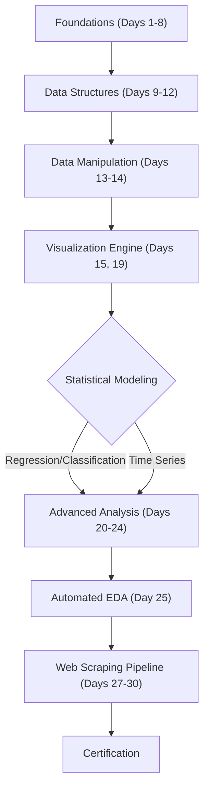

# Technical Specification: R Programming Challenge

## Architectural Overview

**R Programming Challenge** is a structured, linear progression architecture designed to systematically build data science competency through a rigorous 30-day curriculum. The project serves as a comprehensive study into the **R Ecosystem**, bridging the gap from foundational syntax to advanced automation and statistical modeling.

### Learning Logic Flow

---

## Technical Implementations

### 1. Core Computational Engine
-   **Runtime Environment**: Built on **R 4.0+**, utilizing the **Tidyverse** ecosystem for semantic data manipulation and **Base R** for fundamental statistical logic.
-   **Vectorized Performance**: Emphasizes R's native vectorized operations (`apply`, `lapply`, vector arithmetic) to ensure distinct performance advantages over iterative loops in data processing.

### 2. Modules & Libraries
-   **Data Wrangling**: Implements **`dplyr`** and **`tidyr`** for high-velocity data cleaning, transformation, and aggregation.
-   **Visual Synthesis**: Utilizes **`ggplot2`** to construct layered, grammar-of-graphics based visualizations for exploratory data analysis (EDA).
-   **Web Automation**: Deploys **`rvest`** and **`httr`** for designing robust scraping pipelines to extract unstructured data from modern web architectures.

### 3. Statistical Framework
-   **Analysis Pipelines**: The repository structures formal statistical workflows including **Linear/Logistic Regression**, **K-Means Clustering**, and **Time Series Forecasting** (`forecast` package).
-   **Automated EDA**: Integrates `DataExplorer` and `SmartEDA` to auto-generate comprehensive profiling reports for rapid dataset assessment.

---

## Technical Prerequisites

-   **Runtime**: R 4.0.0 or higher ([CRAN](https://cran.r-project.org/)).
-   **Development**: RStudio IDE ([Posit](https://posit.co/download/rstudio-desktop/)).
-   **Dependencies**: Valid `install.packages()` synchronization for Tidyverse and modeling suites.

---

*Technical Specification | R Language | Version 1.0*
